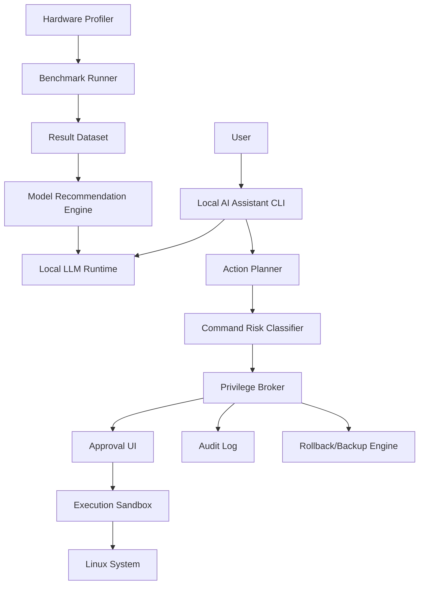

# System Architecture Document

## High-Level Architecture

## Main Design Principle

The AI model is not trusted with direct privileged execution. The privilege broker is the trusted control point.

## Layers

### Layer 1: Hardware Profiling Layer

Collects CPU, RAM, GPU, VRAM, OS, storage, and runtime information.

### Layer 2: Benchmark Layer

Runs model configurations and records speed, memory, latency, quality, and feasibility.

### Layer 3: Recommendation Layer

Ranks model configurations using a weighted scoring formula.

### Layer 4: Local AI Runtime Layer

Runs a selected local model through Ollama, llama.cpp, ONNX Runtime, or another backend.

### Layer 5: Assistant Layer

Interprets user requests and produces a proposed plan.

### Layer 6: Privilege Broker Layer

Classifies risk, enforces policy, requests approval, logs actions, and blocks forbidden commands.

### Layer 7: Execution Layer

Runs approved commands in a controlled environment.

### Layer 8: Safety Layer

Provides audit logs, rollback, backups, sandboxing, and emergency disable.

## Data Flow

1. User asks the assistant for help.
2. Assistant proposes an action plan.
3. Proposed commands are sent to the risk classifier.
4. Risk classifier assigns risk level.
5. Privilege broker decides allow, require approval, require backup, or block.
6. User approves if required.
7. Command executes if approved.
8. Result and logs are saved.
9. Rollback metadata is stored if needed.

## Security Boundary

The AI assistant is outside the trusted boundary. The privilege broker, policy engine, and audit log are inside the trusted boundary.

## Research Contribution

The architecture combines compute-aware model selection with safety-gated local AI system administration.
