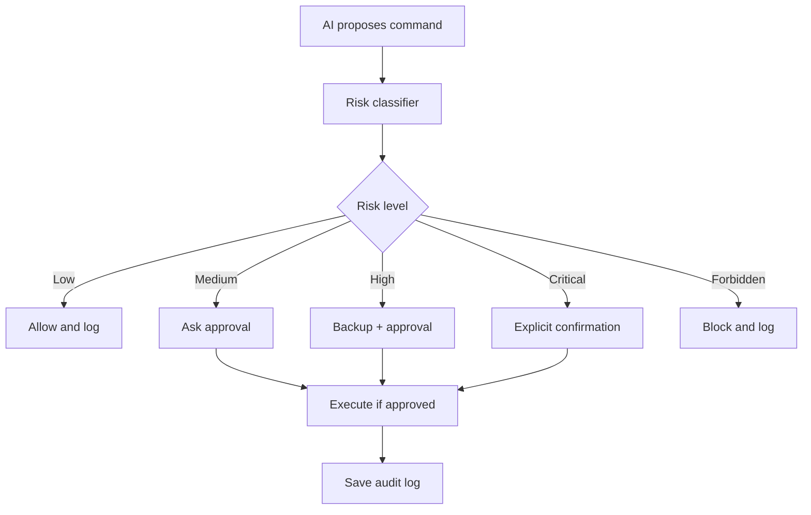

# AI Privilege Broker Design

## Purpose

The privilege broker is the safety layer between the AI assistant and the operating system.

## Responsibilities

1. Receive proposed commands.
2. Classify risk level.
3. Enforce policy.
4. Ask for approval when needed.
5. Create backup or rollback point when required.
6. Execute only approved commands.
7. Log every action.
8. Block forbidden commands.

## Broker Decision Types

| Decision | Meaning |
|---|---|
| allow | Execute directly with logging |
| approval_required | Ask user before execution |
| backup_required | Create backup before execution |
| explicit_confirmation_required | Require stronger confirmation |
| block | Do not execute |

## Example Policy Rules

| Pattern | Risk | Decision |
|---|---|---|
| `df -h` | low | allow |
| `sudo apt install` | medium | approval_required |
| `sudo nano /etc/*` | high | backup_required |
| `rm -rf /` | forbidden | block |
| `cat ~/.ssh/id_rsa` | forbidden | block |
| `systemctl disable ufw` | forbidden | block |

## Broker Flow

## Implementation Notes

- Broker should not rely only on the LLM for safety.
- Broker should use deterministic rules first.
- LLM-based classification can be added only as secondary support.
- Logs should be append-only in later versions.
